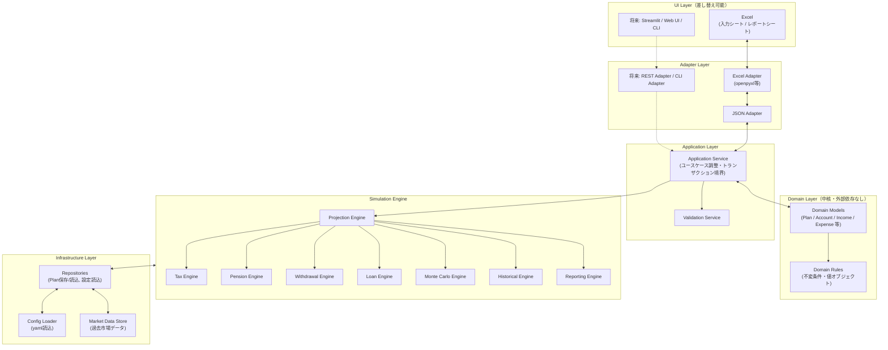
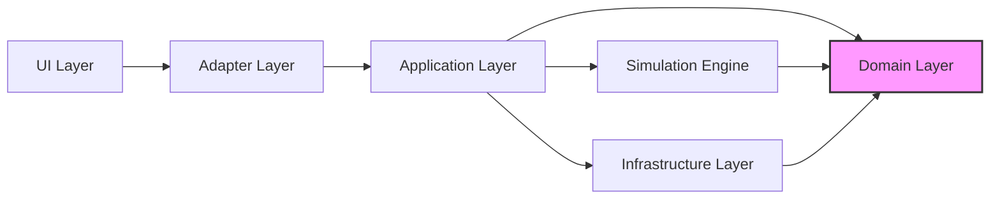
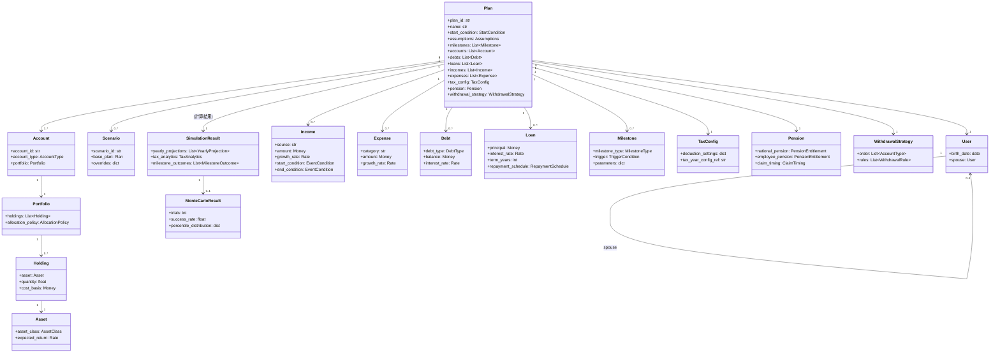
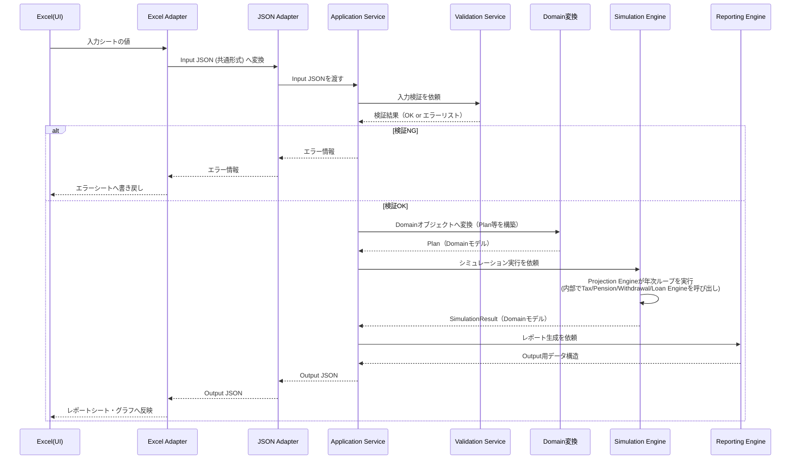
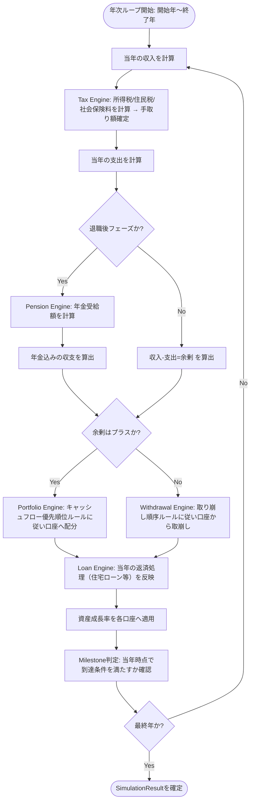
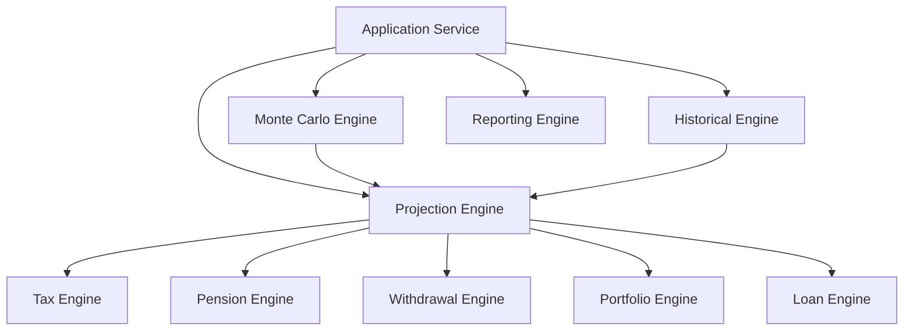
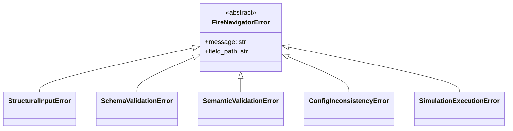
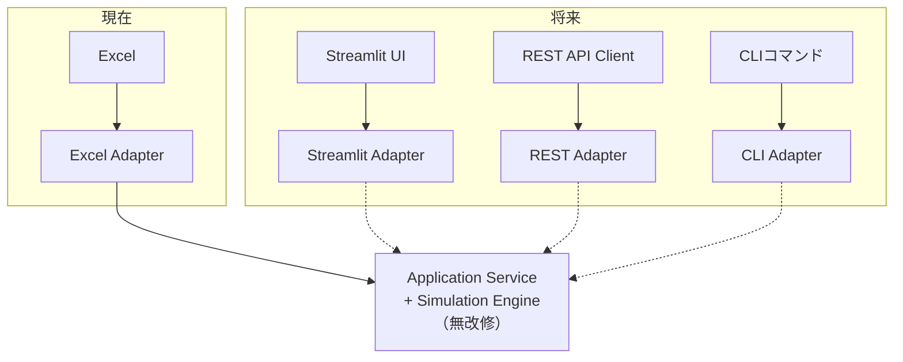

# FIRE Navigator システムアーキテクチャ設計書

版: v1.0
位置づけ: 「ProjectionLab分析設計書」「FIRE Navigator機能方針書」「MVP定義 & Sprintロードマップ」を正式仕様として継承し、実装可能なレベルまで詳細化した設計書。新機能の提案は行わない。既存3文書の内容は変更しない。

設計思想（絶対原則）:
1. Pythonを唯一のシミュレーションエンジンとする
2. Excelは入力・レポートUIであり、ビジネスロジックを一切持たない
3. Engineは「Excelの存在」を知らない（Excel固有の型・セル・シート概念に一切依存しない）
4. 将来的にStreamlit等のWebUIへ置き換え可能な構造にする（Engineは無改修）
5. 保守性・テスト容易性・拡張性を最優先する
6. 商用ソフトウェア品質を目指す

**プロダクトとしての位置づけ（Design Philosophy）**:
FIRE Navigatorは単なる「資産シミュレーター」ではない。人生全体をシミュレーションし、ユーザーの意思決定を支援する**「ライフプランニングエンジン」**である。ProjectionLabを分析のベンチマークとしているが、目的はProjectionLabの再現ではない。より長期的に保守でき、日本の税制・年金制度に最適化され、人生全体を扱えるライフプランニングプラットフォームを構築することが目的である。以下の各章で定めるアーキテクチャ・レイヤー・モジュール構成は、すべてこの思想を土台としている。

---

## 1. システム全体アーキテクチャ

本章の構成図は、FIRE Navigatorが単なる資産シミュレーターではなく、**人生全体をシミュレーションし意思決定を支援するライフプランニングエンジン**であるという前提の上に成り立っている。Simulation Engineが図の中心に据えられているのは偶然ではなく、**「Engine First」**という、このプロジェクトにおいて最も重要な思想の表れである。設計の中心はExcelでもWebでもAIでもなく、常にPython Engineである。UI（Excel、将来のWeb/API/CLI/AI）がどれだけ入れ替わっても、「人生をどう計画するか」という本質的なロジックは常にこのEngineに一元化されるべきだ、という考え方が、1.1の構成図・1.2のレイヤー構成・1.5の役割分担すべての土台になっている。

### 1.1 全体構成図



### 1.2 レイヤー構成（概要）

| レイヤー | 役割 | Excelを知っているか |
|---|---|---|
| UI Layer | 人間が値を入力し、結果を見る場所 | Yes（このレイヤーのみ） |
| Adapter Layer | UI形式 ⇔ 共通JSON形式の相互変換 | Yes（Excel Adapterのみ） |
| Application Layer | ユースケースの調整、入力検証、Engine呼び出しのオーケストレーション | No |
| Domain Layer | ビジネス概念（Plan/Account等）とその不変条件 | No |
| Simulation Engine | 実際の計算ロジック（税・年金・取り崩し・モンテカルロ等） | No |
| Infrastructure Layer | 設定ファイル・市場データ・永続化 | No |

**原則**: Excelという単語が登場してよいのは「UI Layer」と「Adapter Layer（Excel Adapter配下）」のみ。Application Layer以下のコードにopenpyxl等のExcel関連ライブラリのimportが出てきた場合は設計違反。

### 1.3 モジュール構成（概要）

モジュールは「ドメイン知識（何を計算するか）」と「技術的関心事（どう入出力するか）」を明確に分離する。

- `core/domain` … ビジネス概念のデータモデルと不変条件（Engineからもrepositoriesからも参照される、最も安定した層）
- `core/simulation` … 計算ロジック本体（tax, portfolio, withdrawal, loan, montecarlo, historical の各サブエンジン）
- `core/services` … Application Serviceに相当するユースケース調整ロジック
- `repositories` … Plan/Scenarioデータや設定ファイルの読み書きを抽象化
- `adapters` … 外部形式（Excel, JSON, 将来のREST/CLI）とDomainの変換
- `reports` … SimulationResultからレポート（グラフデータ・表）を生成するロジック
- `config` … 制度パラメータ（税制・年金・インフレ等）のyamlファイル群
- `tests` … unit/integration/regressionの3層構造
- `scripts` … 開発・運用補助スクリプト（config検証、regressionベースライン更新等）
- `docs` … 本設計書を含む設計ドキュメント一式

### 1.4 データフロー（概要）

```
Excel入力 → Excel Adapter → 共通Input JSON → Application Service（検証）
→ Domain変換 → Simulation Engine（Projection/Tax/Pension/Withdrawal/Loan/MonteCarlo/Historical）
→ SimulationResult（Domain） → Reporting Engine → 共通Output JSON
→ Excel Adapter → Excelレポートシート
```
詳細は5章に図示する。

### 1.5 ExcelとPythonの役割分担

| 項目 | Excel | Python |
|---|---|---|
| データ入力UI | ○（唯一の入力手段） | × |
| 入力値の一次的な表示整形（見た目） | ○ | × |
| 計算ロジック（税・年金・取り崩し・成長率適用等） | ×（一切持たない） | ○（唯一の計算主体） |
| データ検証（必須項目・型・整合性） | △（簡易な入力規則程度は可） | ○（正式な検証はここで行う。Excel側の検証は事前防止の補助に過ぎない） |
| グラフ・レポート表示 | ○（表示先） | ○（データ生成元。グラフのデータソースをPythonが作る） |
| 設定管理（税率・年金制度等） | ×（Excelに制度パラメータを直書きしない） | ○（configのyamlで一元管理） |

この役割分担により、Excelは「壊れても再生成できるビュー」に徹し、正しさの根拠は常にPython側のコードとテストに一元化される。

より根本的に言えば、**ExcelはView（ビュー）であり、Python Engineこそが唯一の真実（Source of Truth）である**。Excelのシートやセルがどれだけ複雑に見えても、それは計算結果の「表示形式」の一つに過ぎず、計算の正しさそのものを担保する場所ではない。Plan・SimulationResultという「真実のデータ」は常にPython Engine側にのみ存在し、Excelはその一時的な写像でしかない。この非対称性を崩さないことが、将来Web UIやAPI、AIといった別のViewを追加した際にも、すべてのViewが同じ「真実」を参照し続けることを保証する。

---

## 2. ディレクトリ構成

```
fire_navigator/
├── core/
│   ├── domain/
│   │   ├── __init__.py
│   │   ├── user.py
│   │   ├── plan.py
│   │   ├── scenario.py
│   │   ├── account.py
│   │   ├── portfolio.py
│   │   ├── holding.py
│   │   ├── asset.py
│   │   ├── income.py
│   │   ├── expense.py
│   │   ├── debt.py
│   │   ├── loan.py
│   │   ├── milestone.py
│   │   ├── tax_config.py
│   │   ├── pension.py
│   │   ├── withdrawal_strategy.py
│   │   ├── simulation_result.py
│   │   ├── montecarlo_result.py
│   │   └── value_objects.py        # Money, Rate, AgeAt, FiscalYear等の値オブジェクト
│   │
│   ├── simulation/
│   │   ├── __init__.py
│   │   ├── projection/
│   │   │   ├── projection_engine.py    # 年次ループの統括
│   │   │   └── yearly_step.py          # 1年分の状態遷移計算
│   │   ├── tax/
│   │   │   ├── tax_engine.py
│   │   │   ├── income_tax.py
│   │   │   ├── resident_tax.py
│   │   │   └── social_insurance.py
│   │   ├── portfolio/
│   │   │   ├── portfolio_engine.py     # NISA/iDeCo等の口座別配分・成長
│   │   │   └── account_rules.py        # 口座タイプ別の非課税・拠出上限ルール
│   │   ├── withdrawal/
│   │   │   ├── withdrawal_engine.py
│   │   │   └── withdrawal_order.py
│   │   ├── loan/
│   │   │   ├── loan_engine.py
│   │   │   └── amortization.py
│   │   ├── montecarlo/
│   │   │   ├── montecarlo_engine.py
│   │   │   └── random_return_sampler.py
│   │   ├── historical/
│   │   │   ├── historical_engine.py
│   │   │   └── historical_dataset_loader.py
│   │   └── pension/
│   │       ├── pension_engine.py
│   │       └── pension_timing.py       # 繰上げ/繰下げ受給ロジック
│   │
│   └── services/
│       ├── __init__.py
│       ├── plan_simulation_service.py   # Application Service本体
│       ├── scenario_comparison_service.py
│       └── validation_service.py
│
├── repositories/
│   ├── __init__.py
│   ├── plan_repository.py          # Plan/Scenarioの永続化抽象（JSONファイル実装から開始）
│   ├── config_repository.py        # yaml設定の読込抽象
│   └── market_data_repository.py   # 過去市場データの読込抽象
│
├── adapters/
│   ├── excel/
│   │   ├── __init__.py
│   │   ├── excel_input_adapter.py   # Excel → Input JSON
│   │   ├── excel_output_adapter.py  # Output JSON → Excel
│   │   ├── sheet_mapping.py         # シート/セル ⇔ JSONフィールドの対応定義
│   │   └── excel_error_writer.py    # エラーをExcelの専用シートへ書き戻す
│   └── json/
│       ├── __init__.py
│       ├── input_schema.py          # Input JSON Schemaの定義・検証
│       └── output_schema.py         # Output JSON Schemaの定義
│
├── reports/
│   ├── __init__.py
│   ├── networth_report.py
│   ├── cashflow_report.py
│   ├── comparison_report.py
│   └── montecarlo_report.py
│
├── tests/
│   ├── unit/                       # 各モジュール単体（tax計算式1件ずつ等）
│   ├── integration/                # Adapter→Service→Engine→Reportの結合テスト
│   ├── regression/                 # 固定シナリオ×固定configでの結果スナップショット
│   │   └── golden/                 # ベースライン結果（JSON）を保管
│   └── fixtures/                   # テスト用の入力データ・configサンプル
│
├── config/
│   ├── inflation.yaml
│   ├── tax.yaml
│   ├── pension.yaml
│   ├── portfolio.yaml              # NISA/iDeCo等の制度パラメータ（拠出上限等）
│   └── assumptions.yaml            # 成長率・配当利回り等のデフォルト前提
│
├── scripts/
│   ├── validate_config.py          # config整合性チェック
│   ├── update_regression_baseline.py
│   └── run_sample_simulation.py
│
└── docs/
    ├── architecture.md             # 本書
    ├── domain_model.md
    └── config_guide.md
```

### 2.1 各フォルダの役割

| フォルダ | 役割 | 依存してよい先 |
|---|---|---|
| `core/domain` | ビジネス概念のデータ構造と不変条件のみ。計算ロジックは持たない | 標準ライブラリのみ |
| `core/simulation` | 実際の計算アルゴリズム。domainのモデルを受け取り、domainのモデルを返す | `core/domain` のみ |
| `core/services` | ユースケースの調整役。Adapterから呼ばれ、simulationを呼び出す | `core/domain`, `core/simulation`, `repositories` |
| `repositories` | 永続化・設定読込の抽象と実装 | `core/domain`（返却型として） |
| `adapters/excel` | Excel入出力の変換ロジック | `adapters/json`（共通形式へ変換するため経由） |
| `adapters/json` | Input/Output JSONのスキーマ定義・検証 | `core/domain` |
| `reports` | SimulationResultからレポート用データ構造を生成 | `core/domain` |
| `tests` | 各層のテスト | 全レイヤー（テストのみ例外的に全依存可） |
| `config` | 制度パラメータの実データ（yaml） | なし（データファイルのみ） |
| `scripts` | 開発・運用補助 | 全レイヤー呼び出し可（本番コードパスではない） |
| `docs` | 設計ドキュメント | なし |

**思想的な補足**: このディレクトリ構成自体が「Engine First」の表れである。`core/domain`と`core/simulation`（＝Engine）が最も安定した中心に置かれ、`adapters`（Excel等の入出力）はその周辺に配置される。将来Web/API/CLI/AI向けのAdapterが増えても、追加されるのは常に周辺（`adapters/`配下）であり、中心（`core/`）が揺らぐことはない。この構造は、5年後・10年後に開発者が入れ替わったとしても「どこに何があるか」を迷わず判断できることを狙った、長期保守性を優先した配置である。

---

## 3. レイヤー設計（責務と依存方向）

### 3.1 各レイヤーの責務

| レイヤー | 責務 | やってはいけないこと |
|---|---|---|
| **UI Layer** | 人間からの入力受付、結果の表示 | 計算ロジックを埋め込むこと（Excel関数で税額計算する等） |
| **Adapter Layer** | UI固有の形式 ⇔ 共通JSON形式の変換のみ | ビジネスルールの判断（「iDeCoの上限は◯円だから丸める」等はDomain/Simulationの仕事） |
| **Application Layer** | 1回のシミュレーション実行・シナリオ比較実行という「ユースケース」の手順を組み立てる。入力検証の統括 | 個別の税額計算式や年金計算式そのものを書くこと（Simulation Engineの仕事） |
| **Domain Layer** | Plan・Account等の構造と、それ自体が守るべき不変条件（例：残高は負にならない、等）の表現 | 外部I/O・ファイル・Excel・yaml等への直接依存 |
| **Simulation Engine** | 年次計算・税計算・年金計算・取り崩し計算・モンテカルロ計算という「業務ロジックの実体」 | UI形式・永続化形式への依存 |
| **Infrastructure Layer** | 設定ファイル・市場データ・永続化の実装 | ビジネスルールの判断 |

### 3.2 依存方向（逆流禁止）



**原則（クリーンアーキテクチャに準拠）**:
- 矢印は「知っている（importしてよい）」方向を示す。矢印の逆方向のimportは禁止。
- **Domain Layerは最も内側にあり、他のどのレイヤーにも依存しない**（＝Domainのコードにexcel/yaml/jsonライブラリのimportがあれば設計違反）。
- Simulation EngineはDomainのモデルを受け取り・返すのみで、Adapterやyaml読込を直接行わない（必要な設定値はApplication Layer経由でDomainの値オブジェクトとして受け取る）。
- Infrastructure Layer（Repository実装）はDomainの型を返す関数を提供するが、Domain自体はInfrastructureを知らない（依存性逆転の原則：Domain側にRepositoryのインターフェース＝抽象を定義し、Infrastructure側がそれを実装する）。

### 3.3 依存性逆転の実務ルール

- `core/domain` に `PlanRepositoryProtocol` のような抽象（Pythonの`Protocol`または抽象基底クラス）を定義してもよい。
- `repositories/plan_repository.py` はその抽象を実装する（JSON永続化、将来的にDB永続化に差し替え可能）。
- `core/services` は抽象型に対してプログラムし、具体的な実装クラスをコンストラクタ引数として受け取る（DI：依存性注入）。これによりテスト時にはモック実装を注入できる。

**思想的な補足**: 3.2の依存方向図は、技術的な設計規約であると同時に、「Source of Truth」の思想を構造として強制する仕組みでもある。Domain Layerが誰にも依存しないということは、Plan・SimulationResult等の「真実」がUIやInfrastructureの都合によって歪められないということを意味する。また、UI LayerからDomain Layerへ向かう一方向の矢印は、そのまま「Engine First」の依存関係でもある。UI（Excel等）はEngineに依存するが、EngineはUIに一切依存しない。この非対称な依存関係こそが、長期的な保守性・拡張性を支える最も基本的な構造である。

---

## 4. ドメインモデル

ここで定義するドメインモデルは、単なるデータの入れ物ではない。Income・Expense・Milestone・Loan等はいずれも、ユーザーの人生の中で起きる出来事や意思決定を表現するための概念である。FIRE Navigatorが「資産シミュレーター」ではなく「ライフプランニングエンジン」であるという思想（冒頭の設計思想を参照）は、まずこのドメインモデルの粒度に表れている。

### 4.1 主要エンティティ関連図



### 4.2 各モデルの責務・属性・関連（詳細）

| モデル | 責務 | 主要属性 | 関連 |
|---|---|---|---|
| **User** | 本人・配偶者の基本情報を保持 | 生年月日, 配偶者参照 | Plan からの参照元 |
| **Plan** | 1つの資産形成計画全体の集約ルート（Aggregate Root）。すべての設定要素をまとめる | plan_id, name, 開始条件, 前提(Assumptions), 各種リスト | Account/Income/Expense/Debt/Loan/Milestone/TaxConfig/Pension/WithdrawalStrategyを内包 |
| **Scenario** | Planに対する「差分（override）」を表現し、比較機能で使う軽量な派生プラン | scenario_id, base_planへの参照, overrides辞書 | Planを参照、独立コピーは持たない（差分方式でメモリ効率と一貫性を両立） |
| **Account** | 1つの金融口座（NISA/iDeCo/課税口座/現金等）を表現 | account_id, account_type（列挙型）, portfolio | Portfolioを1つ内包 |
| **Portfolio** | 口座内の資産配分（Holdingの集合）と配分方針を管理 | holdings, allocation_policy | Holdingを複数内包 |
| **Holding** | 特定資産の保有数量・取得価額 | asset参照, quantity, cost_basis | Assetを参照 |
| **Asset** | 資産クラス（国内株/全世界株/債券等）ごとの期待リターン定義 | asset_class, expected_return | Config（assumptions.yaml）由来の値を保持 |
| **Income** | 収入源（給与・年金以外の副収入等）の金額・成長・発生条件 | source, amount, growth_rate, start/end condition | Milestoneのトリガー条件と同じ型（EventCondition）を再利用 |
| **Expense** | 支出カテゴリごとの金額・成長 | category, amount, growth_rate | - |
| **Debt** | 返済中の負債（学生ローン等、単純返済） | debt_type, balance, interest_rate | - |
| **Loan** | 住宅ローン等、償却スケジュールを持つ複雑な借入 | principal, interest_rate, term_years, repayment_schedule | Loan Engineが償却表を計算 |
| **Milestone** | FI達成・退職等のイベント定義と到達判定条件 | milestone_type, trigger（単純トリガー。複合条件はCould機能として将来拡張） | Plan配下に複数保持 |
| **TaxConfig** | 税制計算に必要な設定（控除設定・年度別config参照） | deduction_settings, tax_year_config_ref | Tax Engineが参照 |
| **Pension** | 公的年金の見込額・受給タイミング設定 | national_pension, employee_pension, claim_timing | Pension Engineが参照 |
| **WithdrawalStrategy** | 退職後の口座取り崩し順序とルール | order（口座タイプの優先順） , rules | Withdrawal Engineが参照 |
| **SimulationResult** | 1回のシミュレーション実行結果（年次推移・税分析・マイルストーン到達結果） | yearly_projections, tax_analytics, milestone_outcomes | Reporting Engineの入力 |
| **MonteCarloResult** | モンテカルロ実行結果（成功確率・分布） | trials, success_rate, percentile_distribution | SimulationResultに付随（任意） |

**Milestoneについての補足（思想）**: 上表の通り、現時点のMilestoneはFI達成・退職といった目標到達判定に限定されている。これは実装上の初期スコープであり、概念としてのMilestoneはそれに留まらない。結婚・出産・住宅購入・年金開始といった、人生上のあらゆる意思決定ポイントを表現できる「人生イベント」の集合として、将来的にMilestoneが扱う対象は広がっていく。4.1・4.2で示したモデル自体（属性・関連）は現時点のMVPスコープを変更するものではないが、設計として「Milestoneは人生イベントの一種である」という前提を持っておくことが、将来の拡張を自然にする。

**Scenarioについての補足（思想）**: 同様にScenarioも、単なるデータの派生形ではなく、「意思決定支援（Decision Support）」という思想を体現するモデルである。FIRE Navigatorは「60歳で退職すべきです」という単一の正解を提示するソフトウェアではない。55歳・60歳・65歳で退職した場合それぞれのScenarioを比較し、ユーザー自身が判断できる材料を提供することが目的である。Scenarioが「base_planへの差分」という軽量な設計になっているのは、こうした複数案の比較を低コストで行えるようにするためでもある。

### 4.3 値オブジェクト（value_objects.py）

Domain内で使う「意味を持つプリミティブ」は値オブジェクトとして定義し、単なる`float`や`int`を直接使わない。

| 値オブジェクト | 目的 |
|---|---|
| `Money` | 金額（通貨単位・四捨五入ルールを内包し、円未満の誤差混入を防ぐ） |
| `Rate` | 割合（0.05のような生の小数を直接扱わず、パーセント表記との変換ミスを防ぐ） |
| `AgeAt` | 「特定時点での年齢」を表現し、生年月日からの年齢計算ロジックを一箇所に集約 |
| `FiscalYear` | 年度（暦年と会計年度のズレを吸収） |
| `EventCondition` | Milestone/Incomeの発生条件を統一的に表現する型（年齢条件・日付条件・複合条件の共通インターフェース） |

これにより「税額計算のどこかでfloatの丸め誤差が混入する」といった典型的なバグを型レベルで防止する。

**思想的な補足（Traceability）**: 値オブジェクトの導入は、単なるバグ防止以上の意味を持つ。`Money`や`Rate`が計算の各段階で明示的な型として受け渡されることで、「この金額はどこから来て、どう変換されたか」を型定義から追跡できるようになる。これは、将来「この数値の根拠を説明してほしい」という要求（Explainability）に応える際の土台にもなる。

---

## 5. データフロー

### 5.1 全体シーケンス



### 5.2 年次計算ループ内部（Projection Engineの内部フロー）



モンテカルロ実行時は、この年次ループ全体を「1試行」として、リターン系列を確率的にサンプリングしながらN回繰り返す（Monte Carlo Engineが Projection Engineを内部で反復呼び出しする構造）。ヒストリカルバックテストも同様に、過去の実際のリターン系列を1系列ずつ当てはめてProjection Engineを繰り返し呼び出す。

**思想的な補足**: 5.2の年次ループは、技術的には「年ごとの計算手順」だが、その本質は**人生を1年ずつ、その年に起きるライフイベントの積み重ねとして時間軸に沿って適用していく処理**である（Projection Engineの位置づけについては8章で改めて述べる）。また、5.1のシーケンス図が示す通り、Excelから渡された入力は常にPython Engine側で計算・検証され、真実の計算結果（SimulationResult）はEngine内にのみ生成される。Excelは最終的にその結果を「表示」するだけであり、Excel自身が何かを「計算」することは設計上あり得ない（Excel=View、Python Engine=Source of Truthという1.5の思想がここでも一貫している）。

**思想的な補足（Explainability）**: 5.2の年次ループが「収入→税金→社会保険→支出→投資/取り崩し→資産成長→Milestone判定」という明確な順序を持つこと自体が、説明可能性（Explainability）という商用品質の要件を支えている。結果だけを返すのではなく、「なぜこの資産推移になったのか」を、この順序に沿って一段ずつ遡って説明できることを設計上のゴールとする。

---

## 6. JSONスキーマ

Excel依存をなくすため、Engineが受け取る／返す形式はすべてこの共通JSONスキーマに統一する。Excel Adapterの役割は「Excelの値 ⇔ このJSON」の変換のみであり、将来Streamlit等のUIを追加する場合も、新しいAdapterが同じJSONスキーマに変換すればEngineは無改修で動作する。

### 6.1 Input JSON（構造の骨子）

```json
{
  "plan": {
    "plan_id": "plan_001",
    "name": "ベースプラン",
    "start_condition": {
      "type": "today",
      "fixed_date": null
    },
    "user": {
      "birth_date": "1990-04-01",
      "spouse": {
        "birth_date": "1991-07-15"
      }
    },
    "assumptions": {
      "inflation_rate": 0.02,
      "investment_growth_rate": 0.05,
      "config_ref": {
        "tax": "tax_2026.yaml",
        "pension": "pension_2026.yaml",
        "portfolio": "portfolio_2026.yaml"
      }
    },
    "accounts": [
      {
        "account_id": "acc_nisa_growth_001",
        "account_type": "nisa_growth",
        "balance": 3000000,
        "holdings": [
          {"asset_class": "global_equity", "amount": 3000000}
        ]
      },
      {
        "account_id": "acc_ideco_001",
        "account_type": "ideco",
        "balance": 1500000,
        "monthly_contribution": 23000
      }
    ],
    "incomes": [
      {
        "income_id": "income_salary_001",
        "source": "salary",
        "amount_annual": 6000000,
        "growth_rate": 0.01,
        "start_condition": {"type": "plan_start"},
        "end_condition": {"type": "age", "age": 60}
      }
    ],
    "expenses": [
      {
        "expense_id": "expense_living_001",
        "category": "living",
        "amount_annual": 3600000,
        "growth_rate": 0.02
      }
    ],
    "debts": [],
    "loans": [
      {
        "loan_id": "loan_mortgage_001",
        "principal": 30000000,
        "interest_rate": 0.007,
        "term_years": 35
      }
    ],
    "milestones": [
      {
        "milestone_id": "milestone_retire_001",
        "milestone_type": "retirement",
        "trigger": {"type": "age", "age": 60}
      },
      {
        "milestone_id": "milestone_fi_001",
        "milestone_type": "financial_independence",
        "trigger": {"type": "networth_multiple_of_expense", "multiple": 25}
      }
    ],
    "tax_config": {
      "deduction_settings": {
        "basic_deduction": true,
        "spouse_deduction": true
      }
    },
    "pension": {
      "national_pension_estimate_annual": 780000,
      "employee_pension_estimate_annual": 1200000,
      "claim_timing": {"type": "standard", "age": 65}
    },
    "withdrawal_strategy": {
      "order": ["cash", "taxable", "nisa", "ideco"]
    }
  },
  "run_options": {
    "engines": ["projection", "tax", "pension", "withdrawal", "loan"],
    "montecarlo": {
      "enabled": false,
      "trials": 1000
    },
    "historical": {
      "enabled": false,
      "dataset": "jp_global_1990_2025"
    }
  }
}
```

### 6.2 Output JSON（構造の骨子）

```json
{
  "plan_id": "plan_001",
  "simulation_result": {
    "yearly_projections": [
      {
        "year": 2026,
        "age_self": 36,
        "gross_income": 6000000,
        "income_tax": 350000,
        "resident_tax": 300000,
        "social_insurance": 850000,
        "net_income": 4500000,
        "total_expense": 3600000,
        "net_cashflow": 900000,
        "account_balances": {
          "acc_nisa_growth_001": 3300000,
          "acc_ideco_001": 1776000
        },
        "networth": 5076000
      }
    ],
    "tax_analytics": {
      "2026": {
        "marginal_rate": 0.2,
        "effective_rate": 0.108
      }
    },
    "milestone_outcomes": [
      {
        "milestone_id": "milestone_fi_001",
        "achieved": true,
        "achieved_year": 2051
      }
    ]
  },
  "montecarlo_result": {
    "trials": 1000,
    "success_rate": 0.87,
    "percentile_distribution": {
      "p10": 42000000,
      "p50": 68000000,
      "p90": 105000000
    }
  },
  "errors": [],
  "warnings": []
}
```

### 6.3 スキーマ管理方針

- `adapters/json/input_schema.py` / `output_schema.py` にPython側のスキーマ定義（例：`dataclass`または`pydantic`相当の検証構造）を置き、JSON Schema（`.json`）としてもエクスポートできるようにする。
- スキーマのバージョニング（`schema_version`フィールドをトップレベルに持つ）を最初から入れておき、将来の構造変更に備える。

**思想的な補足（Traceability）**: Output JSONに含まれる`tax_analytics`や`milestone_outcomes`は、単なる結果値ではなく、「なぜその年にその税率になったか」「なぜその年にMilestoneが達成されたか」を後から追跡するための手がかりでもある。JSONという構造化された共通形式でEngineの入出力を統一していること自体が、将来「この数値の根拠は何か」を辿れる設計（Traceability）の基盤になっている。

---

## 7. Excelアダプタ設計

### 7.1 設計原則

- Excelのシート・セル・名前付き範囲は「入力欄」または「出力表示欄」としてのみ機能する。
- Excel Adapterは **Excel → Input JSON** と **Output JSON → Excel** の2方向の変換責務のみを持つ。
- `sheet_mapping.py` に「シート名・セル位置（または名前付き範囲）⇔ JSONフィールドパス」の対応表を一元管理し、Excelのレイアウト変更があってもこのファイルの修正のみで追従できるようにする（コード全体に散らばらせない）。

### 7.2 変換フロー

```mermaid
flowchart LR
    A[Excel 入力シート] -->|openpyxlで読込| B[生のセル値<br/>(型はExcelネイティブ: str/float/datetime)]
    B -->|sheet_mapping.py の対応表で変換| C[Input JSON<br/>(共通形式)]
    C -->|input_schema.py で検証| D{検証OK?}
    D -- OK --> E[Application Serviceへ]
    D -- NG --> F[excel_error_writer.py]
    F --> G[Excel エラーシートへ書込]
```


### 7.3 sheet_mapping.py の設計イメージ（構造のみ）

対応表は「シート名」「セル位置または名前付き範囲」「JSONフィールドパス」「型変換ルール」の4項目からなるテーブルとして定義する（実装コードは本書の対象外のため、構造のみ提示）。

| シート名 | セル/名前付き範囲 | JSONフィールドパス | 型変換 |
|---|---|---|---|
| `Input_Accounts` | `NISA_Growth_Balance` | `plan.accounts[type=nisa_growth].balance` | 数値 → Money |
| `Input_Assumptions` | `Inflation_Rate` | `plan.assumptions.inflation_rate` | パーセント表示 → Rate |
| `Report_NetWorth` | `NetWorth_Table` | `simulation_result.yearly_projections[].networth` | Money → 数値表示 |

この対応表自体もテストの対象とする（`tests/integration`で「サンプルExcel→Input JSON→期待値」の変換が正しいことを検証する）。

### 7.4 エラーの扱い

Excel Adapterはビジネスルールの判断をしないため、「値の型が違う」「必須セルが空」といった**構造的エラー**のみをこの層で検出する。「退職年齢が現在年齢より若い」といった**意味的エラー**はValidation Service（Application Layer）が検出する（11章で詳述）。

**思想的な補足**: Excel Adapterは、7.1〜7.4を通じて「Excelはあくまでクライアントの一つである」という思想を最も直接的に体現する層である。Excel Adapterが持つのは変換ロジックのみであり、判断（ビジネスルール）は一切持たない。これは「Engine First」「Source of Truth」という思想を、コードレベルで強制する具体的な実装ルールである。将来Web Adapter・REST Adapter・AI Adapterが追加された場合も、それらは本章と同じ役割（View⇔共通JSON形式の変換のみ）を担うクライアントとして設計されることになる。

---

## 8. シミュレーションエンジン設計

Projection Engineは、単に「年次ループを回す計算機」ではない。その本質は、**人生の中で起きるライフイベント（就職・結婚・出産・住宅購入・退職・年金開始等）を時間軸に沿って適用していくエンジン**である。以下で説明するTax/Pension/Withdrawal/Loan等の各Engineは、それぞれ特定の種類のライフイベントが起きた際に呼び出される「専門家」であり、Projection Engineはその専門家たちを適切な順序で呼び出す「人生の進行役」にあたる。

### 8.1 サブエンジン一覧と責務

| エンジン | 責務 | 入力 | 出力 |
|---|---|---|---|
| **Projection Engine** | 年次ループを統括するオーケストレーター。他の全エンジンをこの中から呼び出す | Plan（Domain） | SimulationResult（税抜き〜税込みの年次推移） |
| **Tax Engine** | 所得税・住民税・社会保険料の計算 | 年収, TaxConfig, tax.yaml | 手取り額, 実効/限界税率 |
| **Portfolio Engine** | 口座タイプ別の非課税判定・拠出上限管理・資産成長の適用 | Account一覧, キャッシュフロー優先順位, portfolio.yaml | 更新後の口座残高 |
| **Pension Engine** | 公的年金の受給額計算（繰上げ/繰下げ反映） | Pension設定, pension.yaml, 現在年齢 | 年金受給額 |
| **Withdrawal Engine** | 退職後の取り崩し順序に従った口座からの引き出し計算 | WithdrawalStrategy, 各口座残高, 不足額 | 取り崩し後の口座残高 |
| **Loan Engine** | 住宅ローン等の償却計算（元利均等等） | Loan設定 | 当年の返済額（元本/利息内訳） |
| **Monte Carlo Engine** | Projection Engineを確率的リターン系列でN回反復実行し、成功確率・分布を集計 | Plan, 試行回数, リターン分布 | MonteCarloResult |
| **Historical Engine** | Projection Engineを過去の実際のリターン系列で反復実行 | Plan, 過去データセット | 系列別のSimulationResult一覧 |
| **Reporting Engine** | SimulationResult/MonteCarloResultからレポート用データ（グラフデータ・比較表）を生成 | SimulationResult等 | レポート用データ構造（Output JSONの一部） |

**Reporting Engineについての補足（思想）**: Reporting Engineの役割は「グラフを作ること」ではない。その存在意義は、ユーザーが複数の選択肢（退職年齢を60歳にするか65歳にするか、NISAをどう使うか等）を比較し、より良い意思決定を下せるようにすることにある。グラフや表はそのための手段であり、目的ではない。言い換えれば、FIRE Navigatorは正解を1つ提示するソフトウェアではなく、複数案を並べてユーザー自身が判断できる材料を提供する**Decision Support System（意思決定支援システム）**である。Reporting Engineを実装・拡張する際は、常に「この出力はユーザーの意思決定にどう役立つか」を問うことを設計上の指針とする。

**思想的な補足（Explainability）**: 同様に、Reporting Engineが生成する結果は「最終的な数値」だけであってはならない。8.1のProjection Engineが辿る「収入→税→社会保険→支出→投資/取り崩し→資産推移」という計算の道筋を、ユーザーが後から追えるように表現することが望ましい。結果を示すことと、結果に至った理由を説明できることは、商用品質において同じ重みを持つ。

### 8.2 呼び出し関係



### 8.3 設計判断：なぜProjection Engineを「オーケストレーター」とするか

**選択肢A**: Application Serviceが全サブエンジンを直接呼び出す
**選択肢B**: Projection Engineが年次ループの中で各サブエンジンを呼び出し、Application ServiceはProjection Engineのみを呼ぶ（採用）

**採用理由**: 年次ループという「時間発展」の制御はドメインロジックの中核であり、Application Layer（ユースケース調整役）に持たせると、Tax/Pension/Withdrawalの呼び出し順序という重要なビジネスルールがApplication Layerに漏れ出してしまう。Projection Engineに閉じ込めることで、モンテカルロ・ヒストリカルの両方が「1年ループを繰り返す」という同じ骨格を再利用できる（Monte Carlo EngineもHistorical EngineもProjection Engineを内部で呼ぶだけで済む）。

---

## 9. テスト戦略

テスト戦略は、この設計が「5年後・10年後でも保守できるか」という長期保守性の思想を最も直接的に検証する仕組みである。特にRegression Testが保持するgolden file（ベースライン結果）は、「制度が変わった時、結果がどう変わったか／変わっていないか」を後から追跡できるという意味で、Traceability（追跡可能性）を実現する仕組みでもある。

### 9.1 3層のテスト

| 種別 | 対象 | 目的 |
|---|---|---|
| **Unit Test** | `core/simulation`配下の各関数・各Engine単体（例：所得税計算式1件） | 個々の計算式が仕様通りであることの保証。制度の1パラメータ変更の影響範囲を最小単位で検証できる |
| **Integration Test** | Adapter → Service → Engine → Report の一連の流れ | レイヤー間の接続（JSON変換ミス、型の不整合等）を検出 |
| **Regression Test** | 固定シナリオ×固定configでの実行結果と、保存済みベースライン（golden file）との比較 | 意図しない計算結果の変化を検出。制度変更や機能追加のたびに必ず実行する |

### 9.2 「税制/年金/NISA制度変更でも既存結果が壊れない」ための設計

- **config自体をバージョン管理する**：`tax_2025.yaml`, `tax_2026.yaml` のように年度別ファイルとして保持し、Planは`config_ref`で「どの年度のconfigを使うか」を明示的に指定する（6.1のInput JSON参照）。制度が変わっても過去に作ったPlanの計算結果は当時のconfigを参照し続けるため、再現性が保たれる。
- **Regressionテストはconfigファイルとセットでgolden fileを保持する**：`tests/regression/golden/`には「どのconfigバージョンで計算したか」をメタ情報として記録し、config更新時に既存goldenが意図せず変わっていないかをまず確認する。意図した変更であれば、レビューを経てgoldenを更新する運用とする。
- **税制ロジックとパラメータを分離する**：計算式（累進課税のロジック等）はPythonコード、税率・控除額等の具体的数値はyamlという分離を徹底する。「税率が変わっただけ」ならyaml変更のみで対応でき、コード変更（＝バグ混入リスク）を伴わない。
- **NISA等の制度変更は`account_rules.py`のルールテーブルをconfig駆動にする**：非課税枠の上限額や対象年数はportfolio.yamlに定義し、コードは「configの値を読んでルールを適用する」だけの汎用ロジックにする。

### 9.3 テストの優先順位（Sprintロードマップとの整合）

- Sprint3（決定論的エンジン）から回帰テストを開始し、以後のSprintごとに対象範囲を拡張する。
- 税制（Sprint5）・年金（Sprint8）・NISA（Sprint6）の導入時点で、それぞれ専用のUnit Testセットを必ず追加する（MVP定義のMust/Should項目に対応）。

---

## 10. 設定ファイル設計

設定ファイル（config）を通じた設計は、短期的な実装の容易さよりも長期保守性を優先するという思想の具体化である。税制・年金・NISA等の制度は将来必ず変わるが、コードではなくconfigの数値を変えるだけで対応できる構造にすることで、5年後・10年後に開発に関わる人が変わっても対応し続けられるようにする。また、Planが`config_ref`でどのconfigバージョンを参照したかを保持すること自体が、「この計算結果はどの制度・どの数値に基づいているか」を後から追跡できるTraceabilityの一部でもある。

### 10.1 config一覧と役割

| ファイル | 内容 | 制度変更時の対応 |
|---|---|---|
| `inflation.yaml` | インフレ率のデフォルト値・シナリオ別値 | 数値を書き換えるのみ |
| `tax.yaml` | 所得税ブラケット、住民税率、社会保険料率、各種控除額 | 年度別セクションを追加するのみ（コード変更不要） |
| `pension.yaml` | 国民年金・厚生年金の給付水準、繰上げ/繰下げの増減率テーブル | 増減率テーブルの数値を更新するのみ |
| `portfolio.yaml` | NISA（成長投資枠/つみたて投資枠）・iDeCoの非課税枠上限、拠出上限、口座タイプ定義 | 上限額の変更、新しい口座タイプの追加（キーの追加のみ） |
| `assumptions.yaml` | 資産クラス別期待リターン・ボラティリティのデフォルト値 | 数値の更新のみ |

### 10.2 tax.yaml の構造イメージ

```yaml
schema_version: 1
tax_year: 2026
income_tax:
  brackets:
    - upper_bound: 1950000
      rate: 0.05
    - upper_bound: 3300000
      rate: 0.10
    - upper_bound: 6950000
      rate: 0.20
    - upper_bound: null   # 上限なし = 最終ブラケット
      rate: 0.45
  basic_deduction: 480000
resident_tax:
  flat_rate: 0.10
  per_capita_levy: 5000
social_insurance:
  health_insurance_rate: 0.05
  pension_insurance_rate: 0.0915
  employment_insurance_rate: 0.006
```

### 10.3 portfolio.yaml の構造イメージ

```yaml
schema_version: 1
config_year: 2026
account_types:
  nisa_growth:
    annual_limit: 2400000
    lifetime_limit: 12000000
    tax_free: true
  nisa_tsumitate:
    annual_limit: 1200000
    lifetime_limit: 6000000  # 成長投資枠と合算管理される点は将来アダプタ層で考慮
    tax_free: true
  ideco:
    monthly_limit_by_category:
      company_employee_no_dc: 23000
      self_employed: 68000
    tax_treatment: "deferred"
```

### 10.4 config読込の設計方針

- `repositories/config_repository.py` が唯一のyaml読込窓口。他のモジュールはyamlファイルを直接開かず、必ずこのRepository経由でDomainの値オブジェクト（`Rate`, `Money`等）に変換された状態で受け取る。
- 起動時（またはシミュレーション実行前）に`scripts/validate_config.py`でスキーマ検証を行い、必須キー欠落や型不整合を早期検出する。

---

## 11. エラーハンドリング

エラーハンドリングもまた、Explainability（説明可能性）という思想の一部である。単に「エラーが起きた」ことを伝えるのではなく、「どこで」「なぜ」問題が起きたのかをユーザーが理解できる形で伝えることを目指す。これは11.2で定義する例外階層が、すべて`field_path`（どのフィールドで問題が起きたか）を持つという設計にそのまま表れている。

### 11.1 エラー分類と検出層

| エラー種別 | 検出層 | 例 |
|---|---|---|
| Excel入力ミス（型不一致、書式崩れ） | Excel Adapter | 「年齢」欄に文字列が入っている |
| 必須項目不足 | JSON Adapter（スキーマ検証） | `birth_date`が未入力 |
| 型エラー | JSON Adapter（スキーマ検証） | `amount_annual`が負の数値 |
| 年齢矛盾（意味的エラー） | Validation Service（Application Layer） | 退職年齢が現在年齢より若い、配偶者の生年月日が未来 |

### 11.2 例外階層（設計方針）



- すべてのカスタム例外は共通基底`FireNavigatorError`を継承し、「どのフィールド（`field_path`）で」「何が」問題かを構造化して持つ。
- Application Serviceはこれらの例外を捕捉し、**例外を握りつぶさず**、Output JSONの`errors`配列（6.2参照）へ変換する。
- Excel Adapter（`excel_error_writer.py`）は`errors`配列を受け取り、Excelの専用「エラーシート」に「シート名・セル・内容」の形で一覧表示する（Excel側で赤字強調などの視覚的分かりやすさを付与してよい＝これは表示ロジックでありビジネスロジックではないため許容）。

### 11.3 ユーザーへの返し方の原則

- **エラーは「どこを直せばいいか」まで含めて返す**：単に「入力エラー」ではなく、対応するExcelのシート名・セル位置（`sheet_mapping.py`の逆引き）まで含めて表示する。
- **警告（warnings）とエラー（errors）を区別する**：計算は継続可能だが結果の信頼性に影響する事項（例：「モンテカルロの試行回数が少なく分布の精度が低い可能性」）は`warnings`として返し、シミュレーション自体は止めない。

---

## 12. 将来拡張（WebUI / REST API / CLIへの移行）

12章全体は、1章で述べた**「Engine First」**という思想がどのようにコードへ具体化されるかを最もよく示す章である。UIが何であれ（Excel・Web・API・CLI・将来のAI）、Engineは中心に居続け、UIはそれを利用するクライアントに過ぎない。

### 12.1 拡張の考え方

Engine（`core/simulation`）とApplication Layer（`core/services`）は一切変更せず、新しいAdapterを追加するだけで新しいUIに対応できる構造とする。



### 12.2 各Adapterが担う変換の対応

| UI | Adapterの役割 |
|---|---|
| Streamlit | フォーム入力値 ⇔ Input JSON、Output JSONの結果をStreamlitのチャート（plotly等）に変換して表示 |
| REST API | HTTPリクエストボディ（JSON）はほぼそのままInput JSONと一致させる設計にしておけば、Adapterは薄いバリデーション層で済む |
| CLI | コマンドライン引数またはYAML/JSONファイル指定 ⇔ Input JSON |

### 12.3 前提として今から守るべきこと

- Input/Output JSONスキーマ（6章）を「Excel専用」ではなく「Engineの正式な公開インターフェース」として設計しておくこと。
- Application Serviceのメソッドシグネチャは「Domainオブジェクトを受け取り、Domainオブジェクトを返す」形にし、戻り値をどうシリアライズするか（Excelに書くかHTTPレスポンスにするか）はAdapterの責任とすること。

この2点さえ守られていれば、12.1の図の通りEngineの無改修でのUI追加が成立する。

**思想的な補足（AIを含む将来展開について）**: この考え方は、将来AI機能（対話的なプランニングアシスタント等）を追加する場合にも同様に適用される。AIは「Engineを呼び出す新しいAdapter、あるいはAdapterを介したクライアント」として位置づけられ、Engine自体にAI固有のロジックを持たせることはしない。AIが人間に代わってInput JSONを組み立て、Output JSONを解釈してユーザーに説明する、という役割分担であれば、Engineは無改修のまま成立する。FIRE Navigatorの中心はあくまでPython Engineであり、Excel・Web・API・CLI・AIのいずれも、その周りに存在する「窓口」の一つに過ぎない、という位置づけは今後も変わらない。

---

## 13. 設計レビュー（自己評価）

この自己評価は、単に技術的な良し悪しだけでなく、「ProjectionLabの再現ではなく、日本の制度に最適化された、人生全体を扱えるライフプランニングプラットフォームを長期的に保守できているか」という、冒頭の設計思想に照らして行う。特に、短期的な実装容易性よりも責務分離・保守性・テスト容易性・拡張性・一貫性を優先するという方針が、5年後・10年後においても揺らがない設計になっているかを基準とする。

### 13.1 この設計のメリット

- **Excel依存の完全排除**：Domain/Simulation層にExcel関連のimportが存在しないため、UI差し替えが構造的に保証される。
- **制度変更への耐性**：税・年金・NISA等の制度パラメータをconfig（yaml）に外出しし、バージョン管理することで、コード変更なしに制度改定に対応でき、かつ過去プランの再現性も担保される。
- **テストしやすい構造**：各Engineが「Domainモデルを受け取り、Domainモデルを返す」純粋関数に近い形になっているため、Unit Testが書きやすい。
- **段階的な機能追加が可能**：Sprintロードマップの各段階（税制コア→口座モデル→マイルストーン→取り崩し・年金→モンテカルロ）が、そのままこの設計のサブエンジン追加順序と一致しており、後工程での手戻りが起きにくい。
- **「意思決定支援」という目的に一貫している**：Domain Layer（人生の出来事を表現するモデル）からReporting Engine（比較・意思決定支援のためのレポート生成）まで、一貫して「計算すること」自体ではなく「ユーザーがより良い意思決定をできるようにすること」を目的とした設計になっている。
- **説明可能性（Explainability）を構造で支えている**：5章・8章の年次ループが「収入→税→社会保険→支出→投資/取り崩し→資産推移」という明確な順序を持ち、4.3の値オブジェクトが各段階の値を型として保持することで、結果だけでなく「なぜその結果になったのか」を後から説明できる土台がある。
- **追跡可能性（Traceability）を構造で支えている**：6章のOutput JSON（tax_analytics・milestone_outcomes等）、9章のRegression Testのgolden file、10章のconfig_refはいずれも、「この数値・この結果はどこから来たのか」を後から辿れるようにする仕組みである。

### 13.2 デメリット・トレードオフ

- **初期の実装コストがやや高い**：レイヤー分離・値オブジェクト・依存性逆転を最初から導入するため、単純な「Excel VBAで完結させる」場合と比べて、Sprint1〜2にかかる基盤構築の工数は大きい。
- **小さな変更でも複数ファイルに触れる場合がある**：例えば新しい口座タイプを1つ追加するだけでも、Domain（account.py）、config（portfolio.yaml）、Adapter（sheet_mapping.py）の複数箇所を変更する必要がある。ただしこれは「変更箇所が明確に分離されている」ことの裏返しでもある。

### 13.3 将来技術的負債になりそうな箇所

- **Scenario（差分方式）の設計**：4.2で「Scenarioはoverridesによる差分方式」としたが、差分の適用ルール（何を上書きし、何を合成するか）が複雑化すると、シナリオ比較機能（Sprint7）の実装時に設計の見直しが必要になる可能性がある。
- **NISA/iDeCoの制度依存ロジック**：現行制度に強く最適化した`account_rules.py`は、将来的な非課税枠制度の抜本改正（例：枠の一本化等）があった場合、config変更だけでは吸収できずコード変更が必要になる可能性がある。
- **モンテカルロ／ヒストリカルのパフォーマンス**：Projection Engineを1試行ずつ愚直に反復する設計は、試行回数が増えると実行時間が線形に増加する。将来的にNumPyベクトル化等の最適化が必要になった場合、Projection Engineの内部実装を変更する必要が生じる（インターフェースは変えずに済む設計にはなっている）。

### 13.4 改善案（将来検討事項として記録。今回は着手しない）

- Scenario差分ルールを明文化した専用の設計ドキュメント（`docs/scenario_diff_rules.md`）をSprint7着手前に作成する。
- `account_rules.py`は「ルールエンジン」として抽象化レベルを上げ、将来の制度改正時にconfigの表現力だけで対応できる範囲を広げておく（ただし過剰設計を避けるため、実際に2つ目・3つ目の制度改正パターンが具体化してから一般化する＝YAGNI原則を優先する）。
- モンテカルロのパフォーマンス最適化は、実測してから（試行回数1000回で許容できない遅さが実際に発生してから）着手する。現時点での先回り最適化はSprintロードマップの優先順位（Must/Should優先）に反するため見送る。

**本章のまとめ（思想）**: ここまでのメリット・デメリット・技術的負債・改善案は、すべて個別の技術判断であると同時に、「なぜこの設計を選んだのか」という問いに対する答えでもある。本設計書は単なるシステムアーキテクチャの仕様書ではなく、FIRE Navigatorというプロダクトが何を目指し、どのような思想（Engine First、Source of Truth、意思決定支援、ライフイベント中心、Explainability、Traceability、長期保守性）で設計されているのかを、将来の開発者が読み返しても理解できることを目標としている。

---

## 付記：既存3文書との整合性について

本書は「FIRE Navigator機能方針書」「MVP定義 & Sprintロードマップ」の内容を変更していない。Sprint1〜10の各終了条件（MVP定義4章）とこの設計書のモジュール分割は次のように対応する。

| Sprint | 主に実装されるモジュール |
|---|---|
| Sprint1 | `adapters/excel`, `adapters/json`（最小疎通）, `tests`基盤 |
| Sprint2 | `core/domain` 一式 |
| Sprint3 | `core/simulation/projection`（税抜き版） |
| Sprint4 | `reports/networth_report.py`, Excel Output Adapter |
| Sprint5 | `core/simulation/tax` |
| Sprint6 | `core/simulation/portfolio`, `config/portfolio.yaml` |
| Sprint7 | `core/domain/milestone.py`, `core/services/scenario_comparison_service.py` |
| Sprint8 | `core/simulation/withdrawal`, `core/simulation/loan`, `core/simulation/pension` |
| Sprint9 | `core/simulation/montecarlo`, `core/simulation/historical`, Progress関連機能 |
| Sprint10 | `tests/regression`拡充, `docs`整備 |
