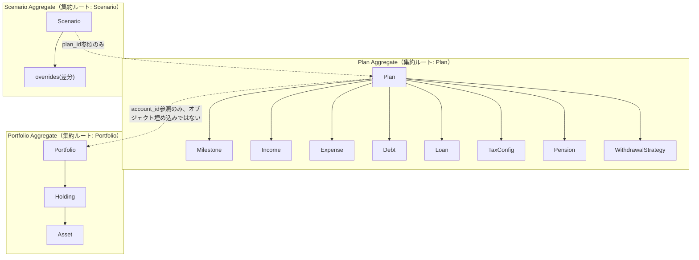
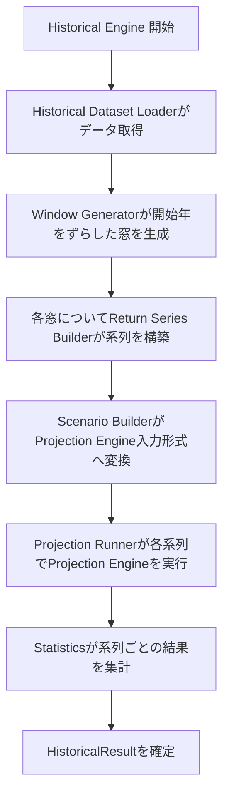
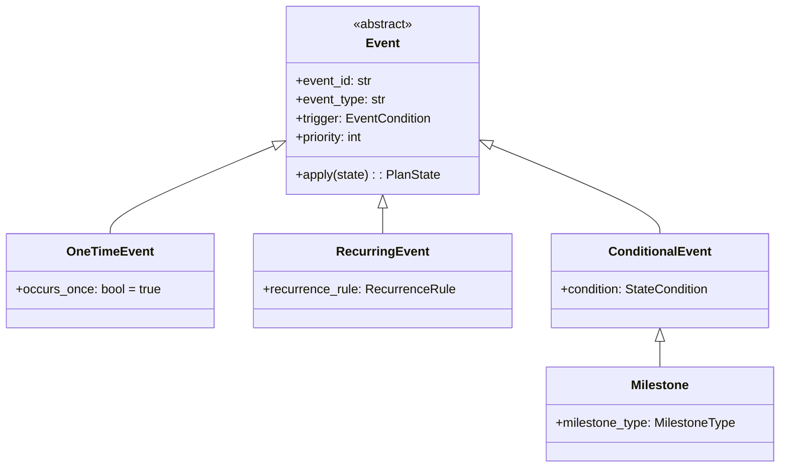
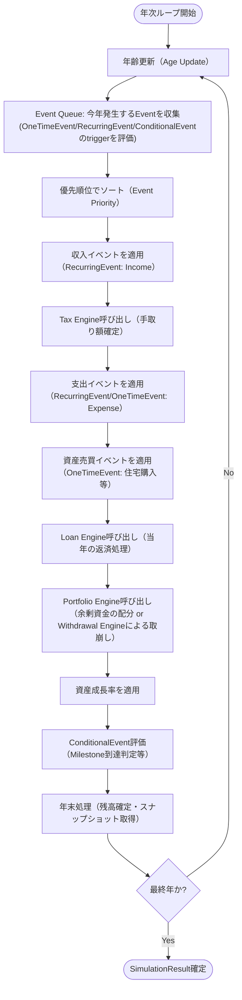

# FIRE Navigator システムアーキテクチャ設計書 v1.1（改訂版）

前提: 本書は「システムアーキテクチャ設計書 v1.0」に対するリファクタリングレベルの改善であり、新機能追加ではない。以下は変更しない。

- 設計思想（Pythonが唯一のEngine／ExcelはUI専用／Engineは将来UI差し替え可能／保守性・テスト容易性・拡張性優先／商用品質）
- 「FIRE Navigator機能方針書」の採用/不採用/日本化/独自追加の判断
- 「MVP定義 & Sprintロードマップ」のMust/Should/Could/WontおよびSprint1〜10の内容

本書が扱うのは「将来ドメインが30以上に増えても保守できる内部構造」への組み替えのみである。各章で **v1.0 → v1.1 の差分** を明示する。

---

## 0. 改訂サマリ（章対応表）

| # | 改善項目 | 変更範囲 |
|---|---|---|
| ① | Simulation Engine再設計 | `core/simulation`配下の構成 |
| ② | Aggregate見直し | `core/domain`のAggregate境界 |
| ③ | Repository構造改善 | `repositories`配下の構成 |
| ④ | Reporting Engine細分化 | `reports`配下の構成 |
| ⑤ | Output JSON改善 | 6章のJSONスキーマ |
| ⑥ | Monte Carlo Engine詳細化 | `core/simulation/montecarlo`内部 |
| ⑦ | Historical Engine詳細化 | `core/simulation/historical`内部 |
| ⑧ | Event Architecture追加（新章） | Projection Engineの制御方式全体 |
| ⑨ | 設計レビュー更新 | 13章 |

---

## ① Simulation Engineの再設計

### v1.0の構成と課題

```
core/simulation/
├── projection/
├── tax/
├── portfolio/
├── withdrawal/
├── loan/
├── montecarlo/
├── historical/
└── pension/
```

**課題**: 今後、教育費・不動産・保険・為替・インフレ・相続などのドメインが追加されると、`core/simulation`直下にフォルダが横並びで30以上並ぶことになる。フォルダの見通しが悪化するだけでなく、各ドメインが「Engine・ルール・計算式・一時データ構造」をそれぞれ独自の粒度・命名で持ちがちになり、ドメインが増えるほど一貫性が失われていく。

### 指示書提案（`engines/rules/calculators/models/shared`を最上位に置く案）との比較

指示書で例示された「処理の種類（engines/rules/calculators/models）を最上位に置く」構成は、機能の切り口としては理解しやすいが、実際には「教育費ドメインの一式を見たい」という時に5つのフォルダ（engines, rules, calculators, models, shared）を横断して探す必要があり、ドメインが増えるほど探索コストが上がる。また、ドメイン間で命名の衝突（例：`tax`と`education`が両方`calculators.py`を持つ）を避けるための工夫が別途必要になる。

### v1.1で採用する構成（ドメイン優先＋共通基盤の分離）

```
core/simulation/
├── framework/                  # 新設: 全ドメインが共有する「型」と「仕組み」
│   ├── engine_base.py           # Engineが実装すべき共通インターフェース(Protocol)
│   ├── engine_registry.py       # ドメインEngineの登録・検索（Projection Engineが参照）
│   ├── calculator_base.py       # 純粋計算関数の共通インターフェース
│   └── result_base.py           # 各Engineの計算結果が満たすべき共通の型
│
├── domains/                    # 新設: ドメインごとに横並びで格納（現状のtax/portfolio等をここへ集約）
│   ├── tax/
│   │   ├── engine.py             # このドメインのEntry Point
│   │   ├── rules.py              # 業務ルール・判定ロジック
│   │   ├── calculators.py        # 計算式そのもの
│   │   └── models.py             # このドメイン固有の計算用一時データ構造
│   ├── pension/            (同上4ファイル構成)
│   ├── portfolio/          (同上)
│   ├── withdrawal/         (同上)
│   ├── loan/               (同上)
│   ├── education/          # 将来追加（教育費）: 同じ4ファイル構成で追加するだけでよい
│   ├── real_estate/        # 将来追加（不動産）
│   ├── insurance/          # 将来追加（保険）
│   ├── forex/              # 将来追加（為替）
│   ├── inflation/          # 将来追加（インフレ）
│   └── inheritance/        # 将来追加（相続）
│
├── projection/                 # 年次ループのオーケストレーター（⑧Event Architectureと統合）
│   ├── projection_engine.py
│   ├── event_queue.py           # 新設（⑧参照）
│   └── event_priority.py        # 新設（⑧参照）
│
├── montecarlo/                  # ⑥で内部詳細化
├── historical/                  # ⑦で内部詳細化
│
└── shared/                     # 新設: ドメインを横断して再利用される「業務非依存の」計算ロジック
    ├── compounding.py            # 複利計算
    ├── amortization.py           # 元利均等等の償却計算（loanとreal_estateの両方が使う）
    └── allocation.py             # 按分計算（cash flow priorityとportfolioの両方が使う）
```

### 設計原則

- **各ドメインフォルダは同一の内部契約（engine.py / rules.py / calculators.py / models.py）に従う**。ドメインが増えても「どこに何があるか」の予測可能性が保たれる。
- **`framework/`はドメイン知識を一切持たない**。新しいドメインを追加する際、`framework/engine_base.py`が定義する共通インターフェースを実装し、`engine_registry.py`に登録するだけで、Projection Engineは個別ドメインのif分岐を増やさずに済む。
- **`shared/`は「2つ以上のドメインで使われることが実際に確認された」計算ロジックのみを置く**。最初から共通化を先読みしすぎない（YAGNI）。例えば償却計算は現時点でLoanドメインにしかないが、将来Real Estateドメインでも使うことが確定した時点で`shared/amortization.py`へ引き上げる。

### 変更点まとめ

| 項目 | v1.0 | v1.1 | 理由 |
|---|---|---|---|
| ドメインの置き場所 | `simulation/<domain>/` が直下に並ぶ | `simulation/domains/<domain>/` に集約 | 直下のフォルダ数を抑制し、`domains/`を見れば全ドメイン一覧が分かるようにする |
| 共通基盤 | なし（各Engineが個別に実装） | `simulation/framework/` を新設 | ドメイン追加時にProjection Engine側の分岐を増やさないため |
| 横断ロジック | 各ドメイン内に重複しがち | `simulation/shared/` に集約 | 償却計算・按分計算等の重複実装を防ぐ |
| 各ドメイン内部 | 構成が個別（v1.0では特に規定なし） | engine/rules/calculators/models の4点セットで統一 | 30ドメイン規模でも同じ場所を見れば同じものが見つかる予測可能性を確保 |

---

## ② Aggregateの見直し

### v1.0の課題

v1.0の`Plan`はAccount・Income・Expense・Debt・Loan・Milestone・TaxConfig・Pension・WithdrawalStrategyをすべて内包する「集約ルート」だった（v1.0 4.1参照）。DDDの観点では、Planが単一のAggregateとして肥大化しており、将来的にPortfolio単体のテストやRepositoryアクセスをしたい場面（例：口座残高だけを更新するAPI）でも常にPlan全体を経由する必要があり、変更の影響範囲が広くなりやすい。

### 見直し方針（YAGNIを優先し、分割は最小限に）

DDDにおけるAggregateの境界は「そのまとまりが独立したトランザクション整合性の単位として意味を持つか」「独立したライフサイクル（作成・削除・参照）を持つか」で判断する。この基準で棚卸しした結果は以下の通り。

| 候補 | 分割するか | 理由 |
|---|---|---|
| **Portfolio Aggregate** | **分割する** | 口座・保有資産・NISA拠出上限といった不変条件（例：残高が非課税枠を超えない等）はPortfolio単体で完結しており、将来のリバランス機能や取り崩しEngineもPortfolio単体を直接操作する必要が出てくる。Plan全体を経由せず独立して読み書きできる境界にする価値が高い。 |
| **Scenario Aggregate** | **分割する** | Scenarioはv1.0でも「Planへの差分（overrides）」という設計だった（v1.0 4.2）。差分の作成・削除・比較はPlan本体のライフサイクルと独立して行われるため、Planの内部リストとして持たせるより、Planを**IDで参照する**独立したAggregateとする方が、Plan集約が「自分の子であるScenario群の整合性まで面倒を見る」という余計な責務を持たずに済む。 |
| **Tax Aggregate** | **分割しない** | TaxConfigは「設定値の集まり」であり、独立したライフサイクル（作成・削除）を持たない。Plan本体と常に一緒に変更・参照される単純な値の集合であり、独立集約にする実益がない。分割するとApplication Service側の整合性調整コードが増えるだけでYAGNIに反する。 |
| **Pension Aggregate** | **分割しない** | 理由はTaxConfigと同様。Pension設定も独立したライフサイクルを持たない値の集合。 |

### 結果としてのAggregate構成



**重要な設計ルール**: Aggregate間の参照は**IDによる参照のみ**とし、オブジェクトの直接埋め込みは行わない。これにより、Portfolio単体の更新がPlan Aggregate全体の再読み込み・再保存を必要としない。複数Aggregateにまたがる整合性（例：シミュレーション実行時にPlanとPortfolio両方が必要）は、Domain層ではなくApplication Service（`plan_simulation_service.py`）が複数Repositoryから読み込んで調整する。

### 変更点まとめ

| 項目 | v1.0 | v1.1 | 理由 |
|---|---|---|---|
| Aggregate数 | 1（Planのみ） | 3（Plan / Portfolio / Scenario） | Portfolio・Scenarioは独立したライフサイクル・整合性境界を持つため |
| TaxConfig/Pension | Planに内包 | 変更なし（Planに内包のまま） | 独立ライフサイクルを持たず、分割は過剰設計（YAGNI） |
| Account⇔Portfolioの関係 | Accountが1つのPortfolioを内包 | Plan→Portfolioの参照はaccount_id経由のID参照に変更 | Aggregate境界をまたぐ参照はIDのみという原則に合わせる |

---

## ③ Repository構造改善

### v1.0の課題

`plan_repository.py` / `config_repository.py` / `market_data_repository.py`がフラットに並んでおり、将来「価格データ」「配当データ」「インフレ実績データ」等のRepositoryが増えると、インターフェース（抽象）と実装（具体）が混在し、どれが差し替え可能な抽象でどれが具体的な実装かが分かりにくくなる。

### v1.1の構成

```
repositories/
├── interfaces/
│   ├── plan_repository_interface.py
│   ├── scenario_repository_interface.py     # 新設（②のScenario Aggregate独立に伴う）
│   ├── portfolio_repository_interface.py    # 新設（②のPortfolio Aggregate独立に伴う）
│   ├── config_repository_interface.py
│   └── market_data_repository_interface.py
│
└── implementations/
    ├── json_plan_repository.py
    ├── json_scenario_repository.py
    ├── json_portfolio_repository.py
    ├── yaml_config_repository.py
    └── csv_market_data_repository.py
```

### 設計原則

- `interfaces/`配下はPythonの`Protocol`（またはABC）のみを定義し、**具体的な永続化技術（JSON/CSV/DB等）に一切依存しない**。
- `implementations/`配下が実際のファイルI/O・パース処理を持つ。
- **Application Layer（`core/services`）は常に`interfaces/`の型に対してプログラムする**。具体的な実装クラスはコンストラクタ引数として注入される（v1.0 3.3の依存性逆転の原則をそのまま踏襲）。
- 将来、価格データや履歴データのRepositoryが増えても、`interfaces/`に1ファイル追加＋`implementations/`に1ファイル追加、という同じパターンで対応できる。

### 変更点まとめ

| 項目 | v1.0 | v1.1 | 理由 |
|---|---|---|---|
| ディレクトリ | フラット構成 | `interfaces/` / `implementations/` に分離 | 抽象と実装の境界を物理的なフォルダ分割で明示し、将来のRepository増加に耐える |
| 対象Repository | Plan/Config/MarketDataの3種 | Scenario/Portfolio用を追加した5種 | ②のAggregate分割に伴い、それぞれ独立して永続化できる必要があるため |

---

## ④ Reporting Engineの細分化

### v1.0の課題

v1.0では「Reporting Engine」が単一の責務としてSimulationResultからレポート用データを一括生成する設計だった（v1.0 8.1）。実際にはグラフ用データ生成・表生成・サマリー生成・KPI生成・出力形式変換という異なる関心事が1つに詰め込まれており、将来PDF/Web/Excel/CLIそれぞれの出力形式に対応する際、この単一Engineが肥大化する。

### v1.1の構成

```
reports/
├── chart_builder.py       # SimulationResultからグラフ用の系列データ（x軸・y軸）を生成
├── table_builder.py       # 年次テーブル等の表形式データを生成
├── summary_builder.py     # FI達成年・成功確率等、一言で状況を要約するサマリーを生成
├── kpi_builder.py         # 貯蓄率・資産形成ペース等のダッシュボード的指標を算出
├── export_builder.py      # 上記すべてを、出力形式に依存しない共通の中間データへ統合
└── report_orchestrator.py # 4つのBuilderを呼び出し、Output JSONのレポート部分を組み立てる
```

### 各Builderの責務

| Builder | 責務 |
|---|---|
| Chart Builder | ネットワース推移・Sankey・モンテカルロ分布等、グラフ描画に必要な系列データを生成する。描画そのもの（色・軸ラベルのUI体裁）は担当しない。 |
| Table Builder | 年次推移テーブル、シナリオ比較表など、行×列の表データを生成する。 |
| Summary Builder | 「FI達成: 2051年」「成功確率: 87%」のような、人間が最初に読む要約文・要約値を生成する。 |
| KPI Builder | 継続的にモニタリングしたい指標（貯蓄率、NISA枠消化率等）を算出する。 |
| Export Builder | Chart/Table/Summary/KPIの各Builder結果を、フォーマット非依存の中間データ構造（Output JSONの`charts`/`tables`/`summary`/`metrics`に相当）へ統合する。実際にPDFやExcelの見た目に変換するのはAdapter層（Excel Adapter、将来のPDF Adapter等）の責務であり、Export Builderはその手前まで。 |
| Report Orchestrator | 上記5つを呼び出す順序・依存関係を制御する。Application Serviceから呼ばれる唯一の窓口。 |

この分割により、「PDFレポートが欲しい」という要望が来た場合も、Chart/Table/Summary/KPI Builderは無改修のまま、新しいPDF用Adapterが`export_builder.py`の出力を受け取ってPDF化するだけで済む。

### 変更点まとめ

| 項目 | v1.0 | v1.1 | 理由 |
|---|---|---|---|
| Reporting Engineの構成 | 単一モジュール | 5つのBuilder + Orchestratorに分割 | 出力形式（PDF/Web/Excel/CLI）が増えてもBuilder自体は無改修で再利用できるようにするため |

---

## ⑤ Output JSONの改善

### v1.0の課題

v1.0のOutput JSON（v1.0 6.2）は`simulation_result` / `montecarlo_result` / `errors` / `warnings`のみで構成されており、UI側（ExcelでもWebでも）が画面を組み立てるための「表示用に整形済みのデータ」が不足していた。UI側で毎回加工が必要になり、将来Web UIを追加した際にExcel Adapterと同じ加工ロジックを重複して書く恐れがある。

### v1.1のOutput JSON構造（追加部分のみ抜粋）

```json
{
  "plan_id": "plan_001",
  "schema_version": 2,
  "summary": {
    "headline": "FI達成見込み: 2051年（59歳時点）",
    "fi_achieved_year": 2051,
    "success_rate": 0.87,
    "networth_at_retirement": 68000000
  },
  "metrics": {
    "savings_rate": 0.32,
    "nisa_utilization_rate": 0.75,
    "ideco_utilization_rate": 1.0,
    "effective_tax_rate_current": 0.181
  },
  "tables": {
    "yearly_projection_table": {
      "columns": ["year", "age", "net_income", "total_expense", "networth"],
      "rows": [
        [2026, 36, 4500000, 3600000, 5076000]
      ]
    },
    "scenario_comparison_table": {
      "columns": ["scenario_name", "fi_achieved_year", "success_rate"],
      "rows": [
        ["60歳退職", 2051, 0.87],
        ["65歳退職", 2048, 0.94]
      ]
    }
  },
  "charts": {
    "networth_chart": {
      "type": "stacked_area",
      "x": [2026, 2027, 2028],
      "series": [
        {"name": "現金", "values": [500000, 520000, 540000]},
        {"name": "NISA", "values": [3300000, 3800000, 4300000]}
      ]
    },
    "montecarlo_distribution_chart": {
      "type": "percentile_band",
      "x": [2026, 2027, 2028],
      "p10": [4000000, 4100000, 4200000],
      "p50": [5000000, 5300000, 5600000],
      "p90": [6200000, 6800000, 7400000]
    }
  },
  "diagnostics": {
    "engines_executed": ["projection", "tax", "pension", "withdrawal", "loan", "montecarlo"],
    "execution_time_ms": 842,
    "config_versions_used": {
      "tax": "tax_2026.yaml",
      "pension": "pension_2026.yaml",
      "portfolio": "portfolio_2026.yaml"
    }
  },
  "simulation_result": { "...": "v1.0と同様（詳細な年次データの原本）" },
  "montecarlo_result": { "...": "v1.0と同様" },
  "warnings": [],
  "errors": []
}
```

### 各追加概念の位置づけ

| 概念 | 目的 |
|---|---|
| `summary` | UIが最初に大きく表示する「一言サマリー」。ExcelでもWebでも同じ内容をそのまま表示できる。 |
| `metrics` | 継続的にモニタリングするKPI。ダッシュボード的な小さな数値カードに使う想定。 |
| `tables` | 表として描画すればよい形（列定義＋行データ）に整形済み。UI側での列名の組み立てが不要になる。 |
| `charts` | グラフライブラリにそのまま渡せる系列データ形式。UI側での系列分解・集計が不要になる。 |
| `diagnostics` | どのEngineが実行されたか、どのconfigバージョンで計算したか、実行時間等の「計算の裏側」情報。デバッグや再現性確認、将来的な監視に利用する。 |

`simulation_result` / `montecarlo_result`（生データ）は引き続き保持し、`summary`〜`charts`は「その生データから作られた表示用の派生データ」という位置づけにする。生データを残すことで、将来UIが求める見せ方が変わっても再度Reporting Engine側で作り直せる。

### 変更点まとめ

| 項目 | v1.0 | v1.1 | 理由 |
|---|---|---|---|
| Output JSONのトップレベルキー | `simulation_result` / `montecarlo_result` / `errors` / `warnings` | 上記に `summary` / `metrics` / `tables` / `charts` / `diagnostics` を追加 | UI側（Excel/Web問わず）がOutput JSONだけで画面生成できる粒度にするため |
| schema_version | 1 | 2 | 構造変更を伴うため明示的にバージョンを上げる |

---

## ⑥ Monte Carlo Engineの詳細化

### v1.0の課題

v1.0では「Monte Carlo Engineが確率的リターン系列でProjection Engineを反復実行する」という粒度までしか定義されておらず（v1.0 8.1）、内部構造が不明瞭だった。

### v1.1の内部構成

```
core/simulation/montecarlo/
├── montecarlo_engine.py      # 全体のオーケストレーター（既存）
├── return_generator.py       # 新設: 年次リターンをサンプリングして返す
├── distribution.py           # 新設: リターン分布のパラメータ定義
├── correlation_matrix.py     # 新設: 資産クラス間の相関構造
├── random_seed.py            # 新設: 乱数シード管理
├── scenario_filter.py        # 新設: 特定条件での試行フィルタリング
├── success_judge.py          # 新設: 試行ごとの成功/失敗判定
└── statistics.py             # 新設: 全試行結果の統計量算出
```

### 各コンポーネントの責務

| コンポーネント | 責務 |
|---|---|
| **Return Generator** | 資産クラスごとの年次リターンをサンプリングして返す。Distribution・Correlation Matrixが提供するパラメータを使ってサンプリングを実行する実行役。 |
| **Distribution** | 各資産クラスのリターン分布（平均・標準偏差、正規分布か対数正規分布か等）の定義を保持・提供する。 |
| **Correlation Matrix** | 複数資産クラス間の相関係数を保持し、Return Generatorが相関を考慮した同時サンプリングを行えるようにする。 |
| **Random Seed** | 乱数シードを管理する。テスト実行時は固定シードを指定することで、モンテカルロ結果を決定論的に再現できるようにする（Regression Testで重要）。 |
| **Scenario Filter** | 「マイルストーン到達が◯歳より前だった試行のみ」等、特定条件で試行結果を絞り込む。 |
| **Success Judge** | 1試行が「成功」（資産が尽きない等の定義）かどうかを判定する。判定基準はPlanのMilestone/WithdrawalStrategyの定義を参照する。 |
| **Statistics** | 全試行の結果を集計し、成功確率・パーセンタイル分布を算出する。 |

### 実行フロー

```mermaid
flowchart TD
    A[Monte Carlo Engine 開始] --> B[Random Seedを初期化]
    B --> C[試行ループ開始 (N回)]
    C --> D[Distribution + Correlation Matrixから<br/>Return Generatorが年次リターン系列を生成]
    D --> E[Projection Engineを1試行実行]
    E --> F[Success Judgeが当該試行を判定]
    F --> G{最終試行か?}
    G -- No --> C
    G -- Yes --> H[Scenario Filterで必要に応じ絞り込み]
    H --> I[Statisticsが成功確率・分布を集計]
    I --> J[MonteCarloResultを確定]
```

### 変更点まとめ

| 項目 | v1.0 | v1.1 | 理由 |
|---|---|---|---|
| Monte Carlo Engine内部 | 単一モジュール（詳細未定義） | 7つのコンポーネントに分解 | 相関・分布・乱数管理・判定・集計をそれぞれ独立してテスト・差し替え可能にするため |

---

## ⑦ Historical Engineの詳細化

### v1.1の内部構成

```
core/simulation/historical/
├── historical_engine.py           # 全体のオーケストレーター（既存）
├── historical_dataset_loader.py   # 既存（v1.0にも存在）: 過去市場データの読込
├── window_generator.py            # 新設: 開始年をずらした複数の「窓」を生成
├── return_series_builder.py       # 新設: 各窓のリターン系列を構築
├── scenario_builder.py            # 新設: リターン系列をProjection Engine入力形式へ変換
├── projection_runner.py           # 新設: 各系列についてProjection Engineを実行
└── statistics.py                  # 新設: 系列ごとの結果を集計
```

### 各コンポーネントの責務

| コンポーネント | 責務 |
|---|---|
| **Historical Dataset Loader** | `market_data_repository`経由で過去の市場データ（日本株・全世界株・債券等）を読み込む。 |
| **Window Generator** | 「1990年開始」「1991年開始」…のように、過去データから複数の開始時点をずらした「窓」を機械的に生成する。 |
| **Return Series Builder** | 各窓について、プランの計画期間分のリターン系列を実データから切り出して構築する。 |
| **Scenario Builder** | Return Series BuilderのアウトプットをProjection Engineが受け取れる入力形式（年次リターン系列）に変換する。 |
| **Projection Runner** | 各系列について、Projection Engineを1回ずつ実行する（並列実行を見据え、実行そのものを専任コンポーネントとして切り出す）。 |
| **Statistics** | 系列ごとの結果（最終ネットワース、Milestone到達年等）を集計し、ばらつきを提示する。 |

### 実行フロー



### 変更点まとめ

| 項目 | v1.0 | v1.1 | 理由 |
|---|---|---|---|
| Historical Engine内部 | 単一モジュール（詳細未定義） | 6つのコンポーネントに分解 | Monte Carlo Engineと対になる構造にし、窓生成・系列構築・実行・集計を独立してテスト可能にするため |

Monte Carlo EngineとHistorical Engineは、いずれも「Projection Engineを繰り返し実行し、統計をとる」という共通の骨格を持つ。将来的に両者の共通部分（試行の反復実行、Statisticsの集計ロジックの一部）を`core/simulation/shared/`へ引き上げる余地があるが、現時点では2つの実装しかなく共通化の要否を判断する材料が不足しているため、v1.1では見送る（YAGNI。⑨で今後の検討事項として記録する）。

---

## ⑧ Event Architecture（新章）

本章が今回の改訂で最も重要な追加である。Projection Engineを「年次ループの中で決まった順序の計算を行う」手続き的な構造から、**「その年に発生するイベントを収集し、優先順位に従って適用する」イベント駆動の構造**へ再設計する。

### 8.1 Eventとは何か

**定義**: Eventとは、計画期間中のある時点（年齢・日付・状態条件のいずれか）で発生し、Planの状態（収入・支出・資産・口座・負債等）に変化を与える、または評価される「時間発生的な単位」である。

FIRE Navigatorが将来的に扱いたい以下のような事象は、すべてEventとして統一的に表現する。

- 退職、住宅購入、住宅売却、資産売却
- 教育費の開始・終了、子供の誕生
- 年金開始、ローン完済
- 不動産購入、相続、贈与、保険金受取
- 副業開始、退職金受取、iDeCo受取
- NISA制度変更（税制config切り替えのタイミング）

v1.0で定義した**Milestone**（core/domain/milestone.py）は、v1.1では「Event体系の中の一種類（達成判定に特化したConditionalEvent）」として位置づけ直す。Milestoneという概念自体・その意味（FI達成・退職等の目標到達判定）はMVP定義通り変更しない。あくまで内部実装上、Event体系のサブタイプとして表現し直すだけである。

同様に、v1.0の`Income`/`Expense`が持っていた`start_condition`/`end_condition`（v1.0 4.3の`EventCondition`）は、v1.1ではEventのトリガー定義としてそのまま再利用される。

### 8.2 Event Interface（型階層）



| 型 | 用途 | 例 |
|---|---|---|
| **Event（基底）** | 全Eventが共通して持つ性質（トリガー・優先順位・状態変化適用メソッド）を定義する抽象型 | - |
| **OneTimeEvent** | 計画期間中に1度だけ発生する | 住宅購入、退職、相続、ローン完済 |
| **RecurringEvent** | 一定の規則で繰り返し発生する | 毎年の給与収入、毎月のiDeCo拠出、毎年の生活費支出 |
| **ConditionalEvent** | 状態（資産額・年齢・市場状況等）が特定の条件を満たした時に発生する | 資産が一定額を下回った際のロスカット、Milestone到達判定 |
| **Milestone（ConditionalEventのサブタイプ）** | 到達を明示的に記録・レポートする目標達成イベント | FI達成、退職 |

この型階層は`core/domain/event.py`に配置する（Eventはビジネス概念であり、v1.0の設計原則通りDomain Layerに属する）。

### 8.3 Event Queueの設計

Projection Engineの年次ループは、以下の手順に再設計する。



Event Queueの役割は「B: 今年発生するEventを収集」「C: 優先順位でソート」の2ステップに集約される。収集されたEvent群は、その`event_type`に応じて、D〜Kの各ステップで適用される（＝Event QueueはEvent自体を保持・整列するだけの薄いコンポーネントであり、実際の適用ロジックは各ドメインEngine（①のdomains/配下）が担う）。

### 8.4 Event Priority（優先順位）

| 優先順位 | 処理 | 対応するEvent種別 |
|---|---|---|
| 1 | 年齢更新 | （ループ制御そのもの、Eventではない） |
| 2 | 収入イベント適用 | RecurringEvent（給与等）、OneTimeEvent（退職金受取等） |
| 3 | 税計算 | （Tax Engineの呼び出し。Eventそのものではないが収入確定後に必ず実行） |
| 4 | 支出イベント適用 | RecurringEvent（生活費等）、OneTimeEvent（教育費開始等） |
| 5 | 資産売買イベント適用 | OneTimeEvent（住宅購入・売却、資産売却） |
| 6 | ローン処理 | RecurringEvent（ローン返済）、OneTimeEvent（ローン完済） |
| 7 | 投資・取り崩し配分 | （Portfolio/Withdrawal Engineの呼び出し） |
| 8 | 資産成長適用 | （成長率の適用そのもの、Eventではない） |
| 9 | 条件付きイベント評価 | ConditionalEvent（Milestone到達判定、ロスカット判定等） |
| 10 | 年末処理 | （スナップショット取得） |

同一優先順位内に複数のEventが該当する場合（例：同じ年に給与収入イベントと退職金受取イベントが両方発生）は、`event_id`の登録順、またはEvent側に付与する副次的な`sequence`値で決定論的に順序を固定する（乱数要素を持ち込まないことで、Regression Testの再現性を担保する）。

優先順位テーブル自体は当面コード内の定数として定義するが、将来「ユーザーが優先順位をカスタマイズしたい」という要望が具体化した場合は、`config/event_priority.yaml`として外出しする拡張余地を残しておく（現時点ではその要望が確定していないため、config化はしない＝YAGNI）。

### 8.5 将来イベントの追加パターン

以下の将来イベントはすべて「①のdomains/配下に新しいドメインフォルダを1つ追加し、対応するEvent型（OneTimeEvent/RecurringEvent/ConditionalEventのいずれか）を定義し、Event Priorityの該当箇所に位置づける」だけで実装できることを目指す。Projection Engineのループ構造自体（8.3の図）は変更不要である。

| 将来イベント | Event種別 | 対応する将来ドメイン（①参照） |
|---|---|---|
| 教育費開始/終了 | RecurringEvent（子供の年齢による開始/終了条件付き） | `domains/education` |
| 証券担保ローン / ロスカット | ConditionalEvent（担保評価額が閾値を下回った場合） | `domains/loan`（拡張） |
| 住宅購入 / 住宅売却 | OneTimeEvent | `domains/real_estate` |
| 不動産CF（賃貸収入等） | RecurringEvent | `domains/real_estate` |
| 相続 / 贈与 | OneTimeEvent | `domains/inheritance` |
| 保険金受取 | OneTimeEvent（またはConditionalEvent：死亡・satisfy条件） | `domains/insurance` |
| 副業開始 | RecurringEvent（開始条件付き） | 既存`domains/`のIncome拡張、または新設`domains/side_business` |
| 退職金 / iDeCo受取 | OneTimeEvent | `domains/pension`（拡張）、`domains/portfolio`（拡張） |
| NISA制度改正 | ConditionalEvent（config切り替え日時条件） | `domains/portfolio`（config参照の切り替えロジックが必要。計画期間中にconfigバージョンが変わるケースは既存の「config_ref」方式の素直な延長では対応しきれない可能性があり、実際にこの要望が具体化した時点で設計を追加検討する（現時点では見送り＝YAGNI）） |

最後の「NISA制度改正」だけは、既存の「Plan単位でconfig_refを1つ持つ」という設計（v1.0 6.1）と、計画期間中の制度切り替えという要求が本質的に緊張関係にあるため、正直にその旨を明記した。これは⑨の「今後の改善余地」にも記載する。

### 変更点まとめ

| 項目 | v1.0 | v1.1 | 理由 |
|---|---|---|---|
| Projection Engineの制御方式 | 手続き的な固定順序ループ（v1.0 5.2） | Event Queueによるイベント駆動ループ | 将来の多様なイベント（教育費・不動産・相続等）を、ループ構造自体を変えずに追加できるようにするため |
| Milestoneの位置づけ | 独立したDomainモデル | ConditionalEventのサブタイプとして再定義 | Event体系に統一し、「目標判定」と「状態変化イベント」を同じ枠組みで扱えるようにするため（意味・機能はMVP定義通り変更なし） |
| Income/Expenseの発生条件 | `EventCondition`という個別の値オブジェクト | Event Queueが扱う`trigger`として統合的に再利用 | 既存の値オブジェクトを廃棄せず、Event体系の一部として位置づけ直しただけ |

---

## ⑨ 設計レビュー更新（v1.1時点）

### 9.1 v1.1で得られたメリット

- **ドメイン追加のコストが「フォルダ1つ＋Event 1つ」に収束した**：①のドメイン構成と⑧のEvent Architectureの組み合わせにより、教育費・不動産・保険等の将来ドメインは、Projection Engine本体（ループの骨格）を一切変更せずに追加できる見通しが立った。
- **Aggregate境界が明確になった**：②によりPortfolio・Scenarioが独立して読み書き・テストできるようになり、将来「口座残高だけを更新するAPI」等の細粒度な操作がPlan全体を経由せず実現できる。
- **Reporting層がフォーマット非依存になった**：④・⑤により、PDF/Web/Excel/CLIのどの出力形式が将来追加されても、Chart/Table/Summary/KPI Builderは無改修で再利用できる。
- **モンテカルロ・ヒストリカルのテスト容易性が向上した**：⑥・⑦で内部コンポーネントに分解したことで、例えば「相関を考慮しない場合の挙動」だけを単体テストする、といった細かい検証が可能になった。

### 9.2 デメリット・トレードオフ

- **ファイル数・抽象化レイヤーが増加した**：v1.0と比べてフォルダ・ファイル数が大きく増える（`framework/`, `domains/`, `interfaces/`, `implementations/`, 5つのBuilder等）。Sprint1〜2の基盤構築コストはv1.0設計よりもさらに増える。ただしこれは「30ドメイン規模での保守性」という目的に対する意図的なトレードオフである。
- **Event Architectureの導入によりデバッグの追跡がやや複雑になる**：手続き的な固定順序ループ（v1.0）は「上から読めば処理順が分かる」という単純さがあったが、Event Queue方式では「その年にどのEventが収集されたか」を可視化する仕組み（診断ログ等）がないと、挙動の把握が難しくなる可能性がある。→対策として、Output JSONの`diagnostics`（⑤で追加）に「その年に適用されたEvent一覧」を含める拡張を今後検討する。

### 9.3 将来技術的負債になりそうな箇所（v1.0からの継続分＋新規分）

- **（v1.0から継続）NISA/iDeCoの制度依存ロジック**：⑧で明記した通り、計画期間中の制度改正（NISA制度改正等）をConditionalEventとして表現しようとすると、現行の「Plan単位で1つのconfig_refを持つ」設計と緊張関係が生じる。実際にこの要望が具体化した時点で、config_refを「時点ごとに切り替え可能なリスト」として再設計する必要が出てくる可能性がある。
- **（新規）Event Priorityのハードコード**：8.4で優先順位をコード内定数としたが、将来ユーザーがカスタマイズしたいという要望が出た場合、config化（YAML化）する必要が出てくる。現時点では要望が確定していないため見送っている。
- **（新規）Monte Carlo EngineとHistorical Engineの重複**：⑥・⑦はいずれも「Projection Engineの反復実行＋統計集計」という共通の骨格を持つが、v1.1では共通化を見送った（実装が2つしかない段階での共通化は過剰設計と判断）。3つ目の「反復実行系」Engine（例えば感度分析の一括実行等）が具体化した時点で、`shared/`への共通化を検討すべきである。
- **（新規）Aggregate間のID参照によるオーバーヘッド**：Plan・Portfolio・Scenarioを別Aggregateにしたことで、シミュレーション実行時に複数Repositoryからの読み込みをApplication Serviceが調整する必要が生じた。将来的にこの調整ロジックが複雑化した場合、専用の「Unit of Work」パターン等の導入を検討する余地がある（現時点では3 Aggregate程度であれば许容範囲と判断）。

### 9.4 今後の改善余地（優先度順、今回は着手しない）

1. **診断ログの充実**：Event Queueが収集・適用したEvent一覧を`diagnostics`に含め、年ごとの挙動をUIから追跡できるようにする。
2. **NISA制度改正のような「計画期間中のconfig切り替え」への対応方針の確定**：具体的な要望が出た段階で設計を追加する。
3. **Event Priorityのconfig化**：ユーザーカスタマイズの要望が出た段階で着手する。
4. **Monte Carlo EngineとHistorical Engineの共通基盤への統合**：3つ目の反復実行系Engineが具体化した段階で検討する。
5. **Unit of Workパターンの検討**：Aggregateが4つ以上に増える、または複数Aggregateにまたがるトランザクション整合性の要求が厳しくなった段階で検討する。

---

## 付記：v1.0との対応関係、およびSprint/MVPへの影響について

- 本書の変更は、v1.0の1〜13章で定めた**外部インターフェース（Input/Output JSONの基本構造、Excel Adapterの責務、レイヤー間の依存方向）を壊すものではない**。Output JSON（⑤）への項目追加は後方拡張であり、既存の`simulation_result`/`montecarlo_result`/`errors`/`warnings`はそのまま残る。
- 「FIRE Navigator機能方針書」のMust/Should/Could/Wont分類、および「MVP定義 & Sprintロードマップ」のSprint1〜10の内容・終了条件は**一切変更しない**。本書はあくまでSprint1〜10で実装するコードの**内部構造**をより保守しやすい形に組み替えたものである。
- 特に⑧のEvent Architectureは、Sprint7（マイルストーン機能）・Sprint8（取り崩し・年金）で実装するロジックの**内部実装方針**であり、Sprintの終了条件（「Excelから実行して結果が得られる」という外部から見た挙動）には影響しない。
